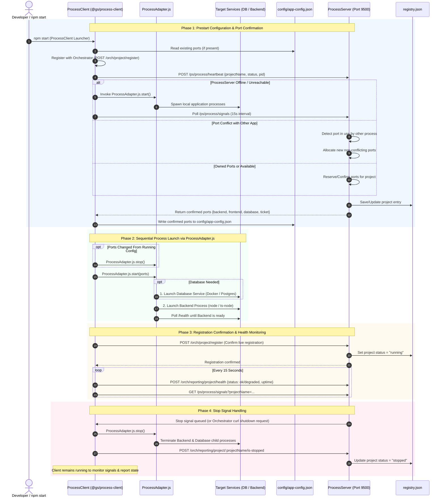

# GS-Orchestrator Process Control Workflow

This document describes the lifecycle and communication workflow for `ProcessServer`, `ProcessClient`, and `ProcessAdapter.js`.

## Lifecycle Rules

1. **ProcessServer Port & Termination**:
   - `ProcessServer` runs on a dedicated, untouchable fixed port **9999** (`:9999`).
   - `ProcessServer` **can only be stopped or taken offline via a node kill command** (`kill`, `SIGTERM`, `SIGKILL`).
2. **Orchestrator Shutdown Rule**:
   - `GS-Orchestrator` (running on port **10000**) **can only be stopped or taken offline via an explicit `curl` shutdown request sent to `ProcessServer`** (e.g., `curl -X POST http://localhost:9999/api/orchestrator/shutdown`).
3. **Static GUI Deployment**:
   - `GS-Orchestrator/angular` is compiled and served statically directly by the `GS-Orchestrator` Node/Express server on port **10000**.
4. **Runnable `ProcessAdapter.js`**:
   - Generated by `ProcessServer` after environment investigation and written as a runnable `ProcessAdapter.js` file in the project root.
   - Acknowledges signal and notifies Orchestrator (`POST /api/register/:projectName/stopped`).
   - Orchestrator updates status to `stopped` without removing project entry from `registry.json`.
   - The Orchestrator Client process continues running to monitor future signals and report status.
