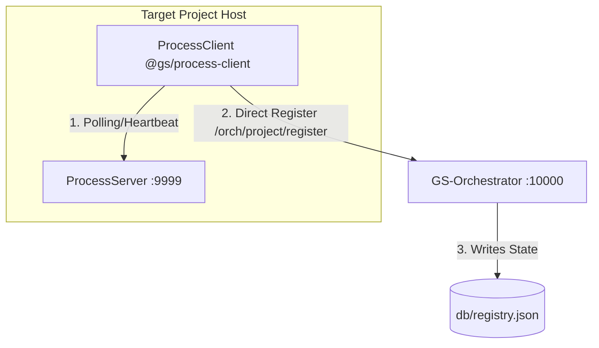
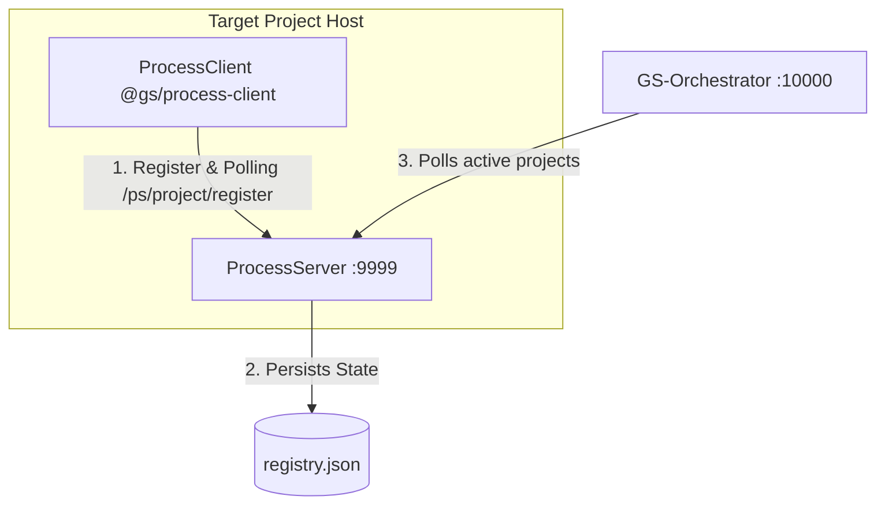

# Architecture Evolution: Process-Server Decoupled Registry

This document describes the architectural transition of the `registry.json` database and project registration flows from the central `GS-Orchestrator` server to the isolated, standalone `ProcessServer` daemon.

---

## 🏛️ Previous vs. New Architectural Model

### 1. Previous Model (Tight Coupling & Local Dependencies)
1. `GS-Orchestrator` (`:10000`) acted as the central database controller, maintaining `db/registry.json`.
2. Target project's `ProcessClient` (running inside consuming projects) had direct HTTP network coupling to `GS-Orchestrator` on port 10000, calling `POST /orch/project/register` over the network to register itself.
3. This broke the decoupling principle: target projects became tightly coupled with port 10000, and could fail registration on startup if the orchestrator server itself was offline (even though the generic components had successfully launched).

### 2. New Model (True Decoupled Registry & Agent Model)
1. `ProcessClient` is **completely decupled** from `GS-Orchestrator` (`:10000`) and has no network dependency on it. It **only** communicates with its remote `ProcessServer` (`:9999`).
2. The `ProcessServer` (`:9999`) holds the `registry.json` database.
3. **Registration Flow**:
   - `ProcessClient` registers local targets directly to the `ProcessServer` via `POST /ps/project/register` (specifying project metadata, paths, services, and running statuses).
   - `ProcessServer` persists and manages project configurations in `registry.json`.
4. **Coordination Flow**:
   - The central `GS-Orchestrator` (`:10000`) acts as a passive, unified control plane/dashboard.
   - It **polls the `ProcessServer`** to retrieve registered projects, statuses, and heartbeats to populate the unified GUI statically.

---

## 📅 Action Plan

To fully finalize this migration seamlessly without impacting active running components:

| Step | Component | Action |
|---|---|---|
| **1** | **`ProcessClient`** | Remove `orchestratorUrl` config parameter, and delete all registration fetch calls directed to port `:10000` (`registerWithOrchestrator`). Instead, issue registration requests directly to `ProcessServer` URL on port `:9999` using `POST /ps/project/register` once components are up and healthy. |
| **2** | **`ProcessServer`** | Create a local registry storage manager and expose a new endpoint `POST /ps/project/register` to save, update, or remove projects in a centralized database (`registry.json`) run by the Process Server. |
| **3** | **`GS-Orchestrator`** | Refactor `RegistryService` and `ServerScannerService` inside `:10000` to delegate registry reads, listings, updates and port allocations directly to the remote `ProcessServer` endpoints. |
