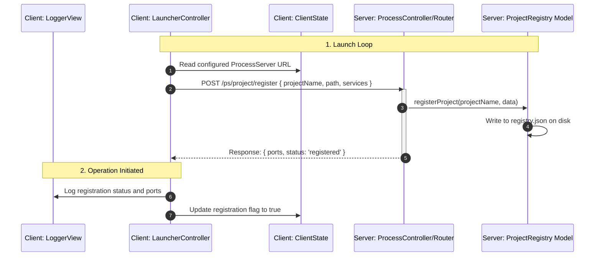

# MVC Architectural Blueprint for Process Handling Components

This document defines the strict Model-View-Controller (MVC) organization and code layout for the decoupled process control plane: `lib/process-server/` and `lib/process-client/`.

---

## 🏛️ 1. ProcessServer MVC Blueprint (`lib/process-server/`)

Since `ProcessServer` is an API/Daemon backend, MVC maps directly as standard Express middleware, data-layer managers, and structured responses.

```
lib/process-server/src/
├── server.ts               # Server Entrypoint & App Configuration
├── routes/                 # Routing Layer
│   ├── installerRoutes.ts
│   ├── processRoutes.ts
│   ├── projectRoutes.ts
│   └── hostRoutes.ts
├── controllers/            # Controller Layer (Request/Response Handlers)
│   ├── InstallerController.ts
│   ├── ProcessController.ts
│   ├── ProjectController.ts
│   └── HostController.ts
├── models/                 # Model Layer (State & Persistence)
│   ├── ProcessRegistry.ts  # Memory Cache of Live PIDs & Heartbeats
│   └── ProjectRegistry.ts  # Persistent storage representing registry.json
├── generators/             # Views/Generators (Code & Templates Output)
│   ├── adapterGenerator.ts # Compiles tailored ProcessAdapter.js
│   └── templates/          # Tailored response scripts served over HTTP
│       ├── install.sh
│       ├── install.js
│       └── CLIENT_INSTALLATION.md
└── domain/                 # Domain Interfaces & Type Definitions
```

### Layer Responsibilities (Server)

* **Models (State & Persistence)**:
  * Manages and synchronizes application data.
  * `ProjectRegistry`: Responsible for reading/writing target project entities into physical storage (`registry.json`). Maintains port bases and structural integrity of the registered domains.
  * `ProcessRegistry`: In-memory state machine capturing alive PIDs, dynamic status indicators (`RUNNING`, `degarded`), and pending control signals.
* **Controllers (Coordination Plane)**:
  * Intercerts HTTP requests, processes security headers, deserializes parameters, updates Models, and delegates response execution to Views.
  * Examples: `InstallerController` manages file streams, `ProcessController` tracks signal loops, `ProjectController` drives the registrations.
* **Views (Representations / Formatters)**:
  * Formats final payload representations returned to clients.
  * Includes the template delivery system (`install.sh`, `install.js`) and the dynamic output of `adapterGenerator.ts` which returns customized runnable JS code blocks tailored to target inspections.

---

## 🏛️ 2. ProcessClient MVC Blueprint (`lib/process-client/`)

Since `ProcessClient` is a head-less daemon library running locally on targets, MVC organizes state machines, operational loops, and diagnostic telemetry outputs.

```
lib/process-client/src/
├── index.ts                # Library Entrypoint
├── models/                 # Model Layer (Client State)
│   ├── ClientConfig.ts     # Config Schema (Url and polling interval parameters)
│   └── ClientState.ts      # Active Operational State (intervals, active timers)
├── controllers/            # Controller Layer (Operational Daemons)
│   ├── LauncherController.ts # Manages operational hooks, start/stop lifecycles
│   ├── PollerController.ts   # Loops target process server signal queries
│   └── HeartbeatController.ts# Sequences ongoing telemetry reports
├── views/                  # View/Output Layer (Telemetry / Logs)
│   ├── TelemetryView.ts    # Transforms state into JSON payloads for HTTP transport
│   └── LoggerView.ts       # Outputs formatted diagnostic statements to terminal & local log file
└── types/                  # Typed interfaces (IProcessAdapter, Config)
```

### Layer Responsibilities (Client)

* **Models (Client State)**:
  * Encapsulates configuration and operational metadata directly on the target host.
  * Spawns no logic or network commands. Pure state objects caching registration tokens, path targets, current interval frequencies, and adapter active PIDs.
* **Controllers (Operational Daemons)**:
  * Implements runtime loops and driver mechanics.
  * `LauncherController`: Coordinates target process startup/shutdown using `ProcessAdapter.js` interface proxies.
  * `PollerController` & `HeartbeatController`: Controls the async cron-style periodic dispatchers to ProcessServer APIs.
* **Views (Log/Telemetry Views)**:
  * Represents state formatting. 
  * `LoggerView` formats status statements for both stdout and file streams (`logs/process-client.log`). 
  * `TelemetryView` maps system parameters into REST-compliant payloads.

---

## 📡 3. Sequence Flow Mapping (MVC Context)


