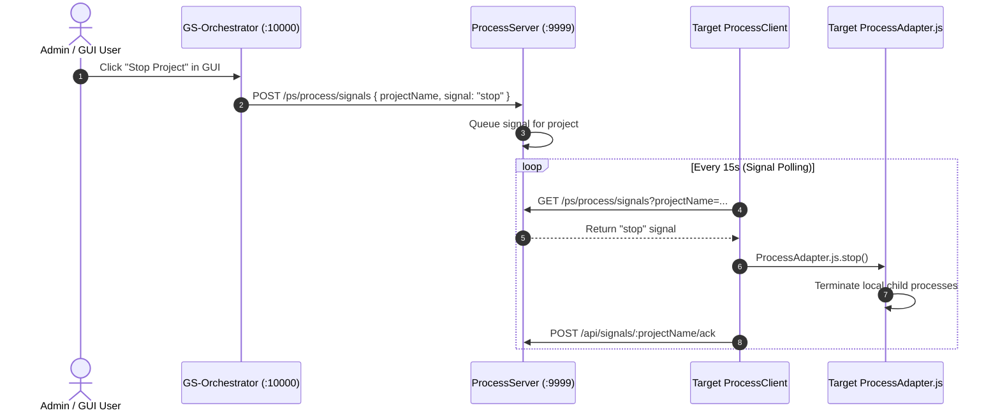

# GS-Orchestrator Architecture Blueprint (`GS-Orchestrator` & `GS-Orchestrator-GUI`)

This document defines the architectural design, component responsibilities, data layer specifications, and frontend hosting model for the **GS-Orchestrator Core Registry & Control Center**.

---

## 🏛️ System Overview

`GS-Orchestrator` is the central service registry, project discovery engine, and web control center for all local ecosystem projects (running on port **10000**). It provides:
1. **Service Registry & Dynamic Port Management**: Keeps track of all registered ecosystem projects, allocated ports, and component health.
2. **Server Scanner & Unregistered Detection**: Automatically scans local network ports to detect unregistered running servers.
3. **User Authentication & Role-Based Access Control**: Handles login, sessions, and superadmin authorization for managing users and project signals.
4. **Control Center Web GUI Hosting**: Hosts the compiled Angular frontend (`GS-Orchestrator-GUI`) statically on its Node/Express server on port **10000**.
5. **Integration with `ProcessServer`**: Communicates with the standalone `ProcessServer` (`lib/process-server/` on port **9999**) for process lifecycle operations and control signals.

---

## 📁 Workspace & Architecture Directory Structure

```
GS-Orchestrator Workspace
├── GS-Orchestrator/                # Orchestrator Registry & Control Center Core (Node/Express :10000)
│   ├── src/
│   │   ├── server.ts               # Express server entrypoint & static GUI host (:10000)
│   │   ├── domain/                 # Domain interfaces & TypeScript types
│   │   ├── routes/                 # Express API routes
│   │   │   ├── authRoutes.ts       # Authentication endpoints (/auth)
│   │   │   ├── adminRoutes.ts      # User management endpoints (/admin)
│   │   │   ├── healthRoutes.ts     # Project health reports (/orch/reporting)
│   │   │   ├── registrationRoutes.ts # Project registration & port allocation (/orch/project)
│   │   │   ├── registryRoutes.ts   # Registry querying & management (/orch/project)
│   │   │   └── scannerRoutes.ts    # Unregistered server scanner (/orch/project/unregistered)
│   │   ├── services/               # Core business logic services
│   │   │   ├── PortAllocatorService.ts # Non-conflicting port assignment
│   │   │   ├── RegistryService.ts      # Persistent project registry state
│   │   │   ├── ServerScannerService.ts  # Network port scanner
│   │   │   └── UserService.ts          # Authentication & user store
│   │   └── utils/
│   │       └── selfDetector.ts     # Self-identification utility
│   ├── processAdapter.js           # Runnable ProcessAdapter.js for Orchestrator itself
│   ├── package.json
│   └── tsconfig.json
├── GS-Orchestrator-GUI/            # Angular Control Center Frontend
│   ├── src/                        # Angular SPA source code
│   ├── angular.json                # Angular CLI configuration (build output: dist/)
│   └── package.json
├── lib/
│   ├── process-server/             # Standalone ProcessServer Engine (:9999)
│   └── process-client/             # ProcessClient Runtime Library (@gs/process-client)
└── architecture/
    ├── ORCHESTRATOR_ARCHITECTURE.md # Architectural Blueprint (This Document)
    ├── PROCESS_HANDLING_ARCHITECTURE.md # Process Handling Engine Blueprint
    └── CLIENT_WORKFLOW.md          # Control Plane Sequence Diagrams
```

---

## 🎯 Architectural Principles

1. **Separation of Concerns**:
   - **`GS-Orchestrator`**: Responsible **strictly** for business domain features: registry, user accounts, UI hosting, and project catalog management on port **10000**.
   - **`ProcessServer` (`:9999`)**: Responsible **strictly** for process management mechanisms: compiling `ProcessAdapter.js`, serving installer scripts over `curl`, and queuing process control signals.
2. **Unified Single-Port Deployment**:
   - The compiled Angular GUI (`GS-Orchestrator-GUI/dist`) is served directly by the `GS-Orchestrator` Express server (`:10000`) using `express.static()`.
   - Eliminates the need for a separate frontend server process (e.g. Angular CLI on `:9001`) in production.
3. **Control via `ProcessServer`**:
   - `GS-Orchestrator` is managed like any other ecosystem project by its own local `ProcessClient` and `ProcessAdapter.js`.
   - `GS-Orchestrator` **can only be stopped or taken offline via an explicit `curl` shutdown request sent to `ProcessServer`** (e.g., `curl -X POST http://localhost:9999/api/orchestrator/shutdown`).
4. **Data Plane vs Control Plane Independence**:
   - `GS-Orchestrator` provides control and visibility into ecosystem projects. It **never** proxies or intercepts application data traffic between projects.

---

## 💻 Web Control Center GUI Hosting Model

```mermaid
graph TD
    Client[Browser / User] -->|HTTP :10000| Express[GS-Orchestrator Express Server]
    
    subgraph GS-Orchestrator Server (:10000)
        Express -->|/orch/*, /auth/*, /admin/*| APIRoutes[API Routes / Domain Services]
        Express -->|Static Asset Request| StaticMiddleware[express.static /dist]
        Express -->|SPA Fallback *| IndexHTML[index.html]
    end

    APIRoutes --> Registry[RegistryService / JSON Database]
    APIRoutes --> PortAlloc[PortAllocatorService]
    APIRoutes --> Scanner[ServerScannerService]
    APIRoutes --> UserStore[UserService]
```

### Express Static Hosting Pattern
```typescript
import path from 'path';
import express from 'express';

const app = express();
const GUI_DIST_PATH = path.join(__dirname, '..', '..', 'GS-Orchestrator-GUI', 'dist');

// Serve compiled Angular static assets
app.use(express.static(GUI_DIST_PATH));

// Domain & Admin routes
app.use('/auth', authRoutes);
app.use('/admin', adminRoutes);
app.use('/orch/project', projectRoutes);
app.use('/orch/reporting', reportingRoutes);

// Fallback all non-API routes to index.html for Angular SPA routing
app.get('*', (req, res, next) => {
  if (req.path.startsWith('/orch') || req.path.startsWith('/auth') || req.path.startsWith('/admin')) return next();
  res.sendFile(path.join(GUI_DIST_PATH, 'index.html'));
});
```

---

## 🔒 Security & Role-Based Access Control

`GS-Orchestrator` enforces a lightweight user management model persisted in `dist/users.json`:

1. **User Roles**:
   - **`superadmin`**: Full administrative privileges (manage users, create/edit users, issue process signals, unregister projects).
   - **`user`**: Read-only access to registry state, project health, and server scanner outputs.
2. **Authentication Flow**:
   - Session-based authentication via REST API (`POST /auth/login`).
   - Default user support (`thor`) with optional password bypass for local development convenience.

---

## 📡 Interaction with `ProcessServer`



---

## ⚙️ Persistence & Data Files

All state in `GS-Orchestrator` is persisted to JSON files in `dist/`:
- **`dist/registry.json`**: Primary project registry (project entries, status, allocated ports, service types).
- **`dist/unregistered-servers.json`**: Cached results of detected running servers not currently registered.
- **`dist/users.json`**: Persisted user accounts and credentials.