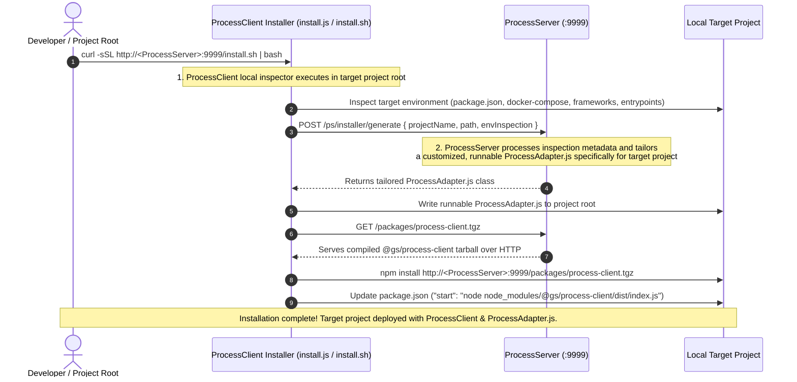
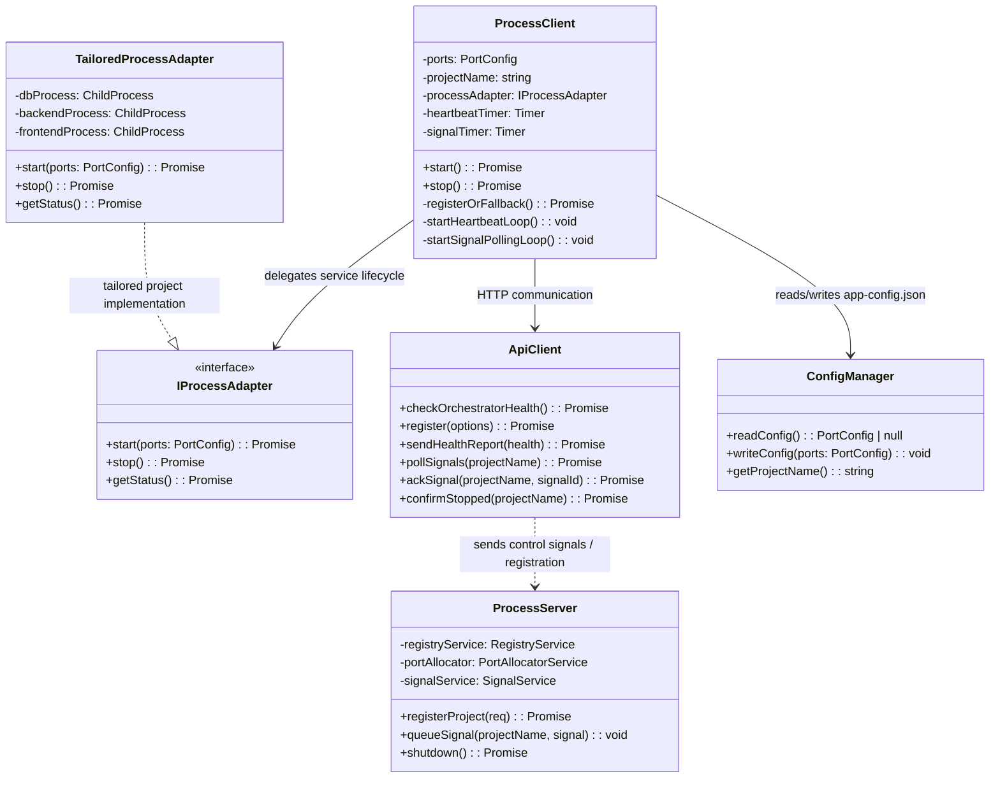
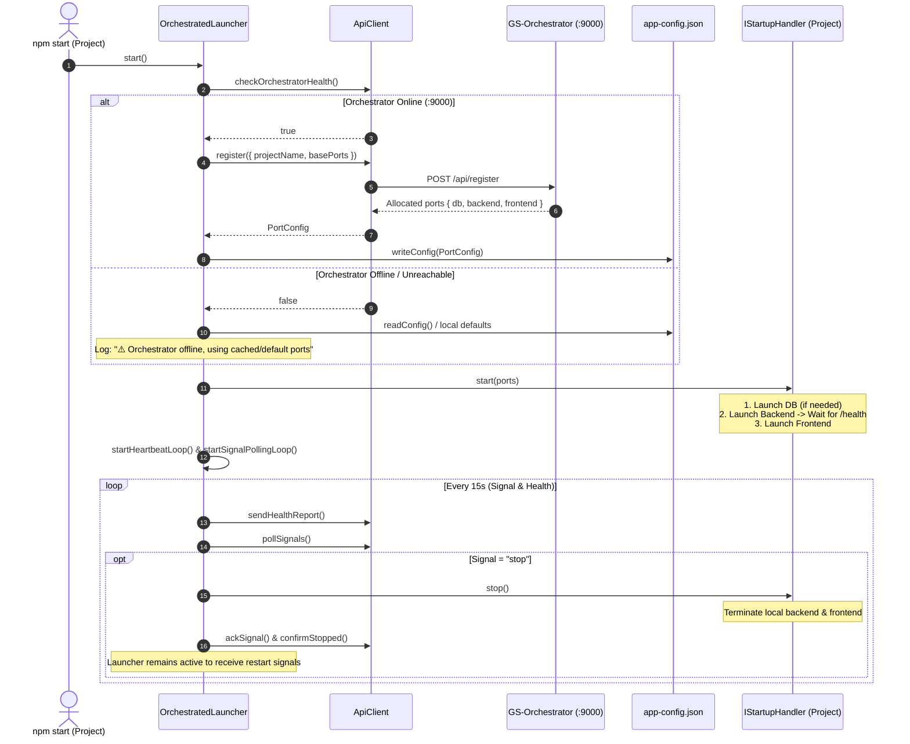

# GS-Orchestrator Process Handling Architecture (`ProcessServer`, `ProcessClient`, & `ProcessAdapter`)

This document defines the architectural design, workspace layout, and lifecycle specifications for the process handling components (`ProcessServer`, `ProcessClient`, and `ProcessAdapter.js`), completely decoupled from the higher-level `GS-Orchestrator` business domain.

---

## 📁 Workspace & Directory Structure

```
GS-Orchestrator Workspace
├── GS-Orchestrator/                # Orchestrator Registry & Control Center Core (Node/Express :10000 serving compiled GUI statically)
├── GS-Orchestrator-GUI/            # Angular Frontend Source (Compiled to dist and served statically by GS-Orchestrator)
├── lib/
│   ├── process-server/             # ProcessServer Microservice (Runs on dedicated fixed port :9999)
│   │   ├── src/
│   │   │   ├── server.ts           # Express server hosting installer, generator, & process control APIs
│   │   │   ├── generator.ts        # ProcessAdapter.js runnable class compiler
│   │   │   └── installerScripts/   # Static install.sh and install.js templates
│   │   ├── package.json
│   │   └── tsconfig.json
│   └── process-client/             # ProcessClient Library (@gs/process-client)
│       ├── src/
│       │   ├── index.ts            # Client runtime entrypoint
│       │   ├── client/             # ProcessClient engine
│       │   └── api/                # ApiClient (/api/register, /api/health, /api/signals)
│       └── package.json
└── architecture/
    ├── ORCHESTRATOR_ARCHITECTURE.md # Orchestrator Business Core Blueprint
    ├── PROCESS_HANDLING_ARCHITECTURE.md # Process Handling Engine Blueprint (This Document)
    └── CLIENT_WORKFLOW.md          # Control Plane Sequence Diagrams
```

---

## 🏛️ ProcessServer Microservice (`lib/process-server/`)

The process management engine operates as an independent, standalone microservice in `lib/process-server/` on its own **untouchable fixed port 9999** (`http://localhost:9999`).

### Responsibilities
1. **Host & Serve Installer Scripts**: Serves `GET /install.sh` and `GET /install.js` for `curl` downloads.
2. **Environment Analysis & Generator Endpoint**: Accepts `POST /api/installer/generate` requests containing environment inspection payloads from consuming projects.
3. **Dynamic Code Generation**: Compiles the inspection metadata and dynamically builds:
   - A tailored, runnable `ProcessAdapter.js` class implementing `IProcessAdapter`.
   - The runtime `@gs/process-client` package configuration files.
4. **Process Control & Registry Management**: Manages port allocations, health heartbeats, signal queues (`start`, `stop`, `restart`), and orchestrator shutdown signals.

---

## 📥 Remote Tailored Installation Architecture (`curl` Workflow)

Consuming projects install and configure process management via a two-stage remote inspection & generation workflow over `curl`:



---

## 🎯 Architecture Core Principles

1. **Decoupled Process Layer**: `ProcessServer`, `ProcessClient`, and `ProcessAdapter.js` are housed in `lib/process-server/` and `lib/process-client/`, cleanly separating generic process control mechanisms from `GS-Orchestrator` business logic.
2. **Untouchable Fixed Port for `ProcessServer`**:
   - `ProcessServer` runs on dedicated, untouchable fixed port **9999** (`:9999`), completely isolated from application server ports and orchestrator core ports.
3. **ProcessServer Termination Rules**:
   - `ProcessServer` **can only be stopped or taken offline via a direct Node process kill** (`kill`, `SIGTERM`, `SIGKILL`). It does **not** expose or honor arbitrary network shutdown commands to take itself offline.
4. **Orchestrator Termination Rules**:
   - `GS-Orchestrator` (running on port **10000**) **can only be stopped or taken offline via an explicit `curl` shutdown request sent to `ProcessServer`** (e.g. `curl -X POST http://localhost:9999/api/orchestrator/shutdown`).
   - Upon receiving the `curl` shutdown request, `ProcessServer` queues a shutdown control signal to `GS-Orchestrator`'s local `ProcessClient`, which invokes `ProcessAdapter.js.stop()` to perform a graceful shutdown of the orchestrator server.
5. **Static Frontend GUI Deployment**:
   - `GS-Orchestrator-GUI` (Angular) is compiled to static files (`ng build`) and deployed directly to the `GS-Orchestrator` Node/Express server (port **10000**), which serves them statically via `express.static()`.
6. **Nomenclature & Role Definitions**:
   - **`ProcessServer`**: Central control server microservice in `lib/process-server/` (`:9999`) that handles registration, port allocation, control signals, and compiles the project's tailored `ProcessAdapter.js`.
   - **`ProcessClient`**: Runtime package (`lib/process-client/`, `@gs/process-client`) deployed to target projects to manage control polling, health heartbeats, and launcher loops.
   - **`ProcessAdapter.js`**: The dynamically tailored, runnable class (stored as `ProcessAdapter.js` in project root) that directly executes service lifecycle tasks (`start()`, `stop()`, `getStatus()`) tailored specifically to the target project environment.
7. **ProcessClient Target Project Deployment**:
   - `ProcessClient` is compiled into a standalone tarball package (`process-client.tgz`) served over HTTP (`GET /packages/process-client.tgz`) by `ProcessServer`.
   - Target projects install `@gs/process-client` as a standard Node module over HTTP URL via the `curl` installer workflow (`npm install http://<ProcessServer>:9999/packages/process-client.tgz`), eliminating any local relative file path dependencies (`file:../...`) and enabling remote cross-machine deployments.
   - Once deployed, `ProcessClient` runs inside the target project workspace to manage the lifecycle of local backend, frontend, and database processes via the runnable `ProcessAdapter.js`.
8. **Client-Driven Registration**: The target project's `ProcessClient` is solely responsible for sending registration requests (`POST /orch/project/register`) to the Orchestrator on startup. The Orchestrator server performs no self-registration.
9. **Clear Separation of Traffic (Control Plane vs Data Plane)**:
   - **Application Data Traffic**: All user requests, REST API calls, database queries, and frontend-to-backend traffic flow **directly** between consuming application components/clients and their respective servers. Application traffic **never** routes through `ProcessServer`.
   - **Orchestrator Control Traffic**: Communication with `ProcessServer` (`:9999`) is strictly limited to control-plane operations: installer generation, initial project registration (`/api/register`), port allocation queries, periodic health heartbeats (`/api/health`), and lifecycle control signal polling (`/api/signals`).
10. **Graceful Offline Fallback**: If `ProcessServer` is offline on `http://localhost:9999`, the deployed `ProcessClient` logs a warning, falls back to cached local ports (`config/app-config.json`) or environment variables, spawns local services via `ProcessAdapter.js`, and retries registration in the background.
11. **Persistent Monitoring Loop**: When a `stop` signal is received from `ProcessServer`, `ProcessClient` terminates child application processes via `ProcessAdapter.js` and notifies `ProcessServer` (`status = stopped`), but keeps the client loop running to listen for future `start` signals.
12. **Standardized `IProcessAdapter` Interface**: Clean object-oriented contract (`start(ports)`, `stop()`, `getStatus()`) for starting and stopping local project services.

---

## 📐 Component Class Diagram



---

## 🔄 Client Execution Sequence



---

## 📋 Interface Specifications

### `IStartupHandler`
```typescript
export interface PortConfig {
  database?: number;
  backend?: number;
  frontend?: number;
  ticket?: string;
}

export interface ComponentStatus {
  database: 'running' | 'stopped' | 'not_configured';
  backend: 'running' | 'stopped' | 'not_configured';
  frontend: 'running' | 'stopped' | 'not_configured';
}

export interface IStartupHandler {
  start(ports: PortConfig): Promise<void>;
  stop(): Promise<void>;
  getStatus?(): Promise<ComponentStatus>;
}
```

---

## 📁 Directory Structure Overview

```
GS-Orchestrator Workspace
├── GS-Orchestrator/                # Main Orchestrator Core Server & Registry (:9000)
├── GS-Orchestrator-GUI/            # Control Center Angular Frontend (:9001)
├── lib/
│   ├── orchestrator-generator/     # Standalone Generator Microservice (Option 2)
│   │   ├── src/
│   │   │   ├── server.ts           # Express server hosting installer & generator endpoints
│   │   │   ├── generator.ts        # StartupHandler class code compiler
│   │   │   └── installerScripts/   # Static install.sh and install.js templates
│   │   ├── package.json
│   │   └── tsconfig.json
│   └── orchestrator-client/        # Compiled client package installed into projects
│       ├── src/
│       │   ├── index.ts            # Client runtime entrypoint
│       │   ├── launcher/           # OrchestratedLauncher
│       │   └── api/                # ApiClient (/api/register, /api/health)
│       └── package.json
└── architecture/
    └── NEW_CLIENT_ARCHITECTURE.md  # Architectural Blueprint
```

---

## 💡 Key Differences & Design Improvements

1. **Eliminated Fallback Shell Scripts**: Removed `|| node startupHandler.js` from `package.json` to eliminate duplicate execution collisions (`EADDRINUSE`).
2. **Complete Isolation from Orchestrator Server**: No code path inside client projects attempts to spawn or manage `GS-Orchestrator`.
3. **Graceful Offline Operation**: If `GS-Orchestrator` is down, the client launches local services using cached ports without crashing.
4. **Clean Abstraction via `IStartupHandler`**: Process spawning and termination logic is cleanly isolated behind a testable class interface.
