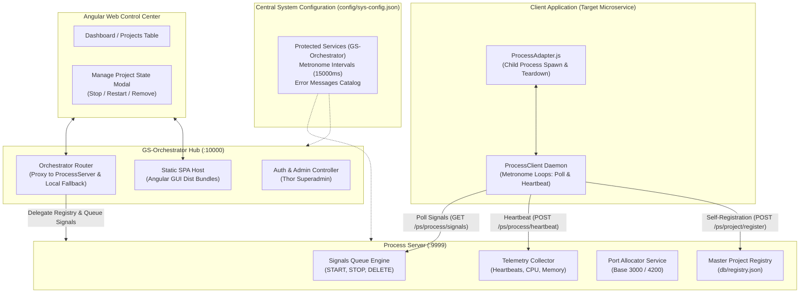
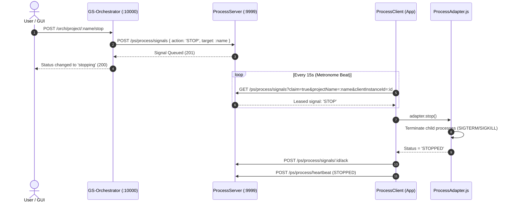
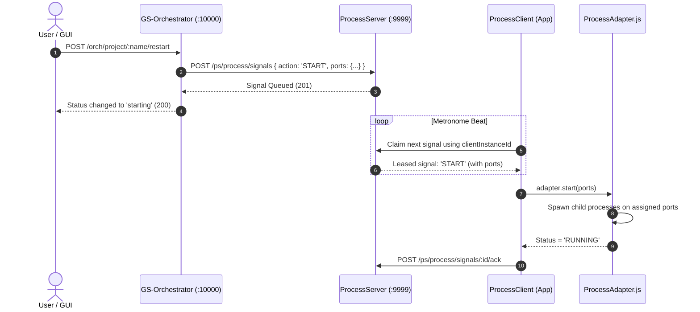
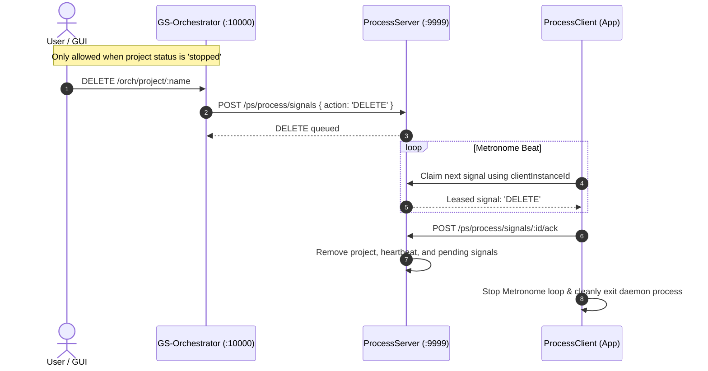

# GS-Orchestrator System Architecture (Today's State)

*Document Date: August 15, 2026*  
*Scope: Complete overview of components, data flow, lifecycle contracts, and testing topology.*

---

## 1. Executive Overview

**GS-Orchestrator** is a lightweight, distributed microservice and application supervisor. It separates:
1. **User Interface & Administration** (`GS-Orchestrator` on `:10000` + Angular GUI)
2. **Signal Routing, Port Allocation & Registry Storage** (`ProcessServer` on `:9999`)
3. **Application Lifecycle & Process Execution** (`ProcessClient` + `ProcessAdapter.js` in each project)
4. **Global System Policy & Rules** (`config/sys-config.json`)

---

## 2. Component Topology & Responsibilities



---

## 3. Clear Breakdown of Each Layer

| Layer / Component | Port / Path | Primary Role | Key APIs & Endpoints |
| :--- | :--- | :--- | :--- |
| **System Config** | `config/sys-config.json` | Single source of truth for global policies, intervals, and error catalogs. | Shared JSON file accessed by Orchestrator and ProcessServer. |
| **Process Server** | `http://localhost:9999` | Fast, decoupled signal queue & master project registry daemon. | `GET/POST /ps/process/signals`<br/>`POST /ps/process/heartbeat`<br/>`GET/POST/DELETE /ps/project/...` |
| **GS-Orchestrator** | `http://localhost:10000` | Management API gateway, auth coordinator, and static Angular GUI host. | `POST /orch/project/register`<br/>`POST /orch/project/:name/stop`<br/>`POST /orch/project/:name/restart`<br/>`DELETE /orch/project/:name`<br/>`GET /orch/project/registry` |
| **Angular GUI** | Served at `:10000` | Single Page App for monitoring status, triggering state actions, and admin controls. | Projects Table, State Modal, Thor Superadmin Login. |
| **Process Client** | Embedded in target app | Background daemon that polls signals and executes adapter functions. | Consumes `ProcessAdapter.js` instance, drives Metronome loop. |
| **Process Adapter** | Target project root | Project-specific script that spawns backend/frontend child processes and stops them cleanly. | `start(ports)`, `stop()`, `getStatus()`. |

---

## 4. End-to-End Lifecycle Flows

### A. Stopping a Project (Safe Teardown)
> **Rule**: Stopping an application puts it into a `stopping` -> `stopped` state. It does **not** delete the project from the registry.



---

### B. Restarting a Project
> **Rule**: Restarting queues a `START` signal containing the allocated ports for the application's components.



---

### C. Removing a Project (Unregistering)
> **Rule**: A project can **only** be removed if it is **already in the `stopped` state**. Removing issues a `DELETE` signal that unregisters the project and shuts down the client daemon.



---

## 5. Security & Protection Policies

1. **Immutable Core Hub (`GS-Orchestrator`)**:
   - `GS-Orchestrator` is designated as a protected service in `config/sys-config.json`.
   - Any attempt to stop, unregister, or mark `GS-Orchestrator` as stopped (via API or GUI) is rejected with HTTP `400 Bad Request`.
   - Protection enforcement is validated at both the `GS-Orchestrator` router and `ProcessServer` signal queue layer.

2. **Role-Based Access Control**:
   - Superadmin (Thor) authentication protects destructive operations and administrative dashboard controls.

---

## 6. Automated Testing Matrix

Testing is automated and orchestrated through `testing/src/TestManager.ts`:

```
┌────────────────────────────────────────────────────────────────────────┐
│ STAGE 1: SFT (Functional Tests - Jest)                                │
│ • Port allocation, registration rules, metrics, health reporting      │
├────────────────────────────────────────────────────────────────────────┤
│ STAGE 2: SIT (Integration Tests - Jest)                                │
│ • ProcessServer API (:9999) + Orchestrator API (:10000)               │
│ • Signal lifecycle, telemetry heartbeats, core immutability tests     │
├────────────────────────────────────────────────────────────────────────┤
│ STAGE 3: UIT (Browser UI Tests - Playwright)                           │
│ • Full browser end-to-end user journeys in Chromium                    │
│ • Thor Login -> Table verification -> Stop -> Restart -> Remove modal │
└────────────────────────────────────────────────────────────────────────┘
```
