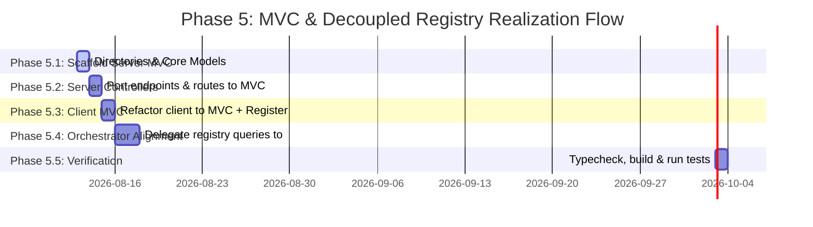

# Phase 5 Plan: MVC Refactor & Decoupled Registry

This document defines the structured phase-by-phase implementation plan to transition `lib/process-server/` and `lib/process-client/` to the MVC design pattern, and completely migrate the project registry (`registry.json`) from `GS-Orchestrator` (:10000) to the standalone `ProcessServer` (:9999).

---

## 📋 Phase 5 Breakdown

---

### 🔨 Phase 5.1: Process-Server Scaffold & Core Models
**Goal**: Build the directory skeleton and model domain operations under `lib/process-server/`.

- [ ] Create folder structure under `lib/process-server/src/`:
  - `models/`
  - `controllers/`
  - `routes/`
- [ ] **Model: ProjectRegistry (`src/models/ProjectRegistry.ts`)**:
  - Implement full JSON persistence layer matching incoming target registration parameters.
  - Implement dynamic port assignments matching scanning availability.
  - Auto-create and maintain `db/registry.json`.
- [ ] **Model: ProcessRegistry (`src/models/ProcessRegistry.ts`)**:
  - Encapsulate in-memory tracking of telemetry logs, heartbeats, and signal queues.

---

### 🔨 Phase 5.2: Process-Server Express Routing & Controller Migration
**Goal**: Decouple request handlers from `server.ts` into dedicated controller classes and map them via Express routing tables.

- [ ] **`InstallerController` & `installerRoutes.ts`**:
  - Expose `/install.sh`, `/install.js`, `/install/instructions`, `/packages/process-client.tgz`, and generator triggers `/ps/installer/generate`.
- [ ] **`ProcessController` & `processRoutes.ts`**:
  - Expose heartbeat and signal queuing listeners (`/ps/process/heartbeat`, `/ps/process/signals`).
- [ ] **`HostController` & `hostRoutes.ts`**:
  - Expose unregistered listening port scanners (`/ps/host/unregistered`, `/ps/host/check-ports`).
- [ ] **`ProjectController` & `projectRoutes.ts`** (Unified Decoupled Registry controller):
  - Expose endpoint **`POST /ps/project/register`** allowing standalone clients to register services parameters, directory paths, and initial statuses.
- [ ] **Clean Up `server.ts`**:
  - Strip all raw router statements, setup CORS and JSON parameters, import `/routes` index middleware, and boot listener cleanly.

---

### 🔨 Phase 5.3: Process-Client MVC Refactoring
**Goal**: Separate client-side network parameters and loops into Model-Controller contexts, removing any trace of direct Orchestrator `:10000` couplings.

- [ ] Create folder structure under `lib/process-client/src/`:
  - `models/`
  - `controllers/`
  - `views/`
- [ ] **Models (`ClientState.ts`, `ClientConfig.ts`)**:
  - Hold execution states, loop trackers, directory context parameters, and active configuration constants.
- [ ] **Views (`TelemetryView.ts`, `LoggerView.ts`)**:
  - Decouple terminal logs printing and logging append scripts from daemon processes.
  - Map status models neatly into REST-compliant payloads.
- [ ] **Controllers (`LauncherController.ts`, `PollerController.ts`, `HeartbeatController.ts`)**:
  - `LauncherController`: Starts the execution loop, spawns targets via Local `ProcessAdapter.js`, and manages target shutdown requests.
  - `HeartbeatController`: Performs periodic telemetry heartbeats (`POST /ps/process/heartbeat`). Once components are healthy, **performs client-driven registration directly to `ProcessServer` via `POST /ps/project/register`**.
  - `PollerController`: Checks signal streams (`GET /ps/process/signals`) and delegates startup/shutdown orders to adapter threads.

---

### 🔨 Phase 5.4: Orchestrator Service Realignment & Data Binding
**Goal**: Transition `GS-Orchestrator` (`:10000`) and the Angular GUI to pull registries recursively from `ProcessServer` (:9999).

- [ ] **Refactor `ServerScannerService` inside `:10000`**:
  - Clean up scanning loop to poll active projects directly from `ProcessServer`'s list of registered heartbeats (`GET http://localhost:9999/ps/process/heartbeats`).
  - Auto-map heartbeats back into the local cache.
- [ ] **Refactor `RegistryService` inside `:10000`**:
  - Since the source of truth is now `ProcessServer`'s registration registry, update endpoints to either act as a read-through proxy to `ProcessServer`'s routes or fetch directly from the remote domain registry.

---

### 🔨 Phase 5.5: Unified Compilation & Test Pass
**Goal**: Run verification sweeps to verify everything is compilation-green and all integration suites pass.

- [ ] Core type-check and TS build pass across all workspaces:
  - `npm run build` at workspace root.
- [ ] Integration validation test passage:
  - Run Playwright E2E verification specs (`npm run test:uit`).
  - Run Unit/Integration regression sweeps (`npm run test:sft`, `npm run test:sit`).
